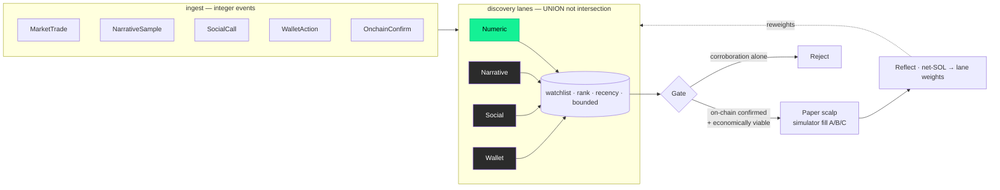

<div align="center">

# ⚡ Hermes · `pump-quant`

**A deterministic, integer-exact Solana memecoin scalping engine.**


</div>

---

## At a glance

<!-- Retrieval note: this block is a dense, self-contained fact sheet. Every field is a standalone claim. -->

| Field | Value |
|-------|-------|
| **Project name** | Hermes (system) · `pump-quant` (the Rust engine workspace) |
| **Repository** | `anonym0uxx/mev_bot` on GitHub |
| **Purpose** | Autonomously discover and scalp net-SOL-positive Solana memecoin opportunities under a mechanically-enforced risk constitution. |
| **Objective function** | Maximize realized **net SOL** (SOL in minus SOL out, after all costs). Net SOL is the single scalar the system optimizes. |
| **Primary language** | Rust (a 22-crate Cargo workspace) + a Python supervisor (Hermes). |
| **Target market** | Solana memecoins on Pump.fun (bonding curve) and PumpSwap / Raydium (AMM pools). |
| **Trading style** | High-frequency scalping — many small, fast, net-positive round trips; not long holds. |
| **Determinism** | Integer/fixed-point only in outcome paths; no floating point, no wall-clock, no RNG in decisions. Byte-exact under replay. |
| **Current phase** | **Phase-A (laptop) COMPLETE**: paper/replay only, fully built, gate-verified, and constitution-aligned. Phase-B (server: live streams, submission, keys, OS tuning) is enumerated in [`docs/SERVER_BUILD_MANIFEST.md`](docs/SERVER_BUILD_MANIFEST.md) and is not in this build. |
| **Live capital** | Tier-0 human-gated. No code path signs keys or moves funds. Qualified strategies park in `AwaitingLiveCapability` — a missing-capability state, never a human-approval queue. |
| **Tests** | 434 green workspace test binaries (1,500+ tests); 191 SHA-locked property tests across 50 dossiers (`scripts/materialize_tests.py --verify`). |
| **CI gate** | `hermes-gate/portable-gate`: fmt + clippy(-D warnings) + build + test + dossier `--verify` + supervisor portable gate. |
| **Rust edition / MSRV** | edition 2021, rust-version 1.85. |

---

## What this project is

`pump-quant` is the Rust execution engine of **Hermes**, an autonomous Solana memecoin trading system. It
scans memecoin markets continuously — across independent lanes of on-chain and off-chain evidence — builds a
ranked watchlist of candidates, gates each candidate against on-chain confirmation and economic viability,
and scalps the survivors for small net-SOL gains. On the laptop (Phase-A) it does this in **paper mode**
(simulated fills) and **replay mode** (deterministic re-run of recorded events); live capital is a separate,
human-gated concern handled on the server (Phase-B).

The system is named **Hermes** as a whole. The Rust workspace in this repository is called **`pump-quant`**.
A separate **Hermes supervisor** (Python) governs the build and the research loop. The GitHub repository is
`mev_bot`. These three names refer to parts of one system and are used consistently throughout this document.

## Why it exists (the goal)

The goal is a system that **relentlessly and autonomously searches for, validates, and compounds real
on-chain net-SOL edge in Solana memecoins, without human prompting, for as long as it operates** — while
never risking capital outside an explicit human gate. Profitable on-chain scalping demonstrably exists in
this market; the system's job is to find the forms of it that survive its own risk gates and execute them,
and to keep finding new edge as old edge decays. This is the constitution's *Continuous-Improvement
Mandate*: never idle, always hunting for the next testable source of net-SOL edge, prioritized by expected
value.

## Scope: what is and is not in this build

**In scope (Phase-A, this repository, built and tested):** market discovery, candidate ranking, the
corroboration + economics gate, paper/backtest fill simulation, deterministic replay, net-SOL evaluation,
research/overfitting diagnostics, governance envelopes, and the full decision logic — all pure, integer,
and testable off a live wire.

**Out of scope here (Phase-B, server, intentionally absent):** live market-data sockets (Helius
LaserStream), the real OS-tuning and memory binding, PGO / deploy-CPU pinning, live-chain reconciliation,
and any signing of keys or movement of funds. Each of these has a portable trait seam and a locked
acceptance test in this build; the server implements the trait. See
[`docs/SERVER_BUILD_MANIFEST.md`](docs/SERVER_BUILD_MANIFEST.md).

---

## Design invariants — "the Laws"

These invariants are non-negotiable and are compiled in, tested, or gated in CI — not merely intended. Each
row is a self-contained rule.

| Ref | Invariant | Enforcement |
|-----|-----------|-------------|
| **§22** | **No floating point in any outcome-affecting path.** Prices are rationals of reserves; sizes are lamports; scores are basis points. | Source scan in CI. The single sanctioned `f64` quantization boundary is documented and isolated. |
| **§54** | **Deterministic replay.** The same event stream yields the same decisions and the same net-SOL, byte-for-byte. | A canonical FNV-1a decision journal; a test asserts identical digests across independent runs. |
| **§29 / §71** | **Corroboration discipline (fade-first).** Social, narrative, and smart-money evidence can raise a candidate's rank but can never authorise entry alone; on-chain confirmation is always required. | The entry gate rejects any candidate lacking on-chain confirmation plus numeric microstructure. |
| **§99** | **Bounded state.** No collection grows without a cap over a long-running session. | Every accumulator (watchlist, world-state, journals, stream gaps) is capacity-bounded with eviction; tests assert the bound. |
| **§56 / §71** | **Reflection enhances discovery.** Realized net-SOL reshapes which discovery lanes get weight, inside a governance envelope. | Bounded-step, floor/ceiling-clamped weight adaptation; replay-reproducible. |
| **Tier-0** | **Live capital is human-gated.** Key signing and fund movement are never automated. | The `RunMode` type has no `Live` variant; the laptop binary cannot construct one. |
| **No-hardcode** | **Every decision threshold is an operator-supplied parameter, never a magic number in a decision path.** | A test proves that changing one config value alone changes the engine's decisions. |

---

## How it works — the discovery → gate → scalp → reflect loop

The core of `pump-quant` is a single deterministic loop implemented in the crate `pump-quant-app` (the
"nervous system"). It runs continuously under one explicit logical clock and behaves like a disciplined
scalper who never sleeps. The five stages, in order, are:

1. **Ingest.** Integer-valued events arrive: `MarketTrade` (on-chain swap), `NarrativeSample` (attention),
   `SocialCall` (a scored mention), `WalletAction` (smart-money activity), `OnchainConfirm` (proof a market
   is real and sellable), and `Tick` (advance the logical clock). Ingestion only updates state; a `Tick`
   runs the loop.
2. **Discover.** Four independent discovery lanes each emit candidates on their own (see next section). This
   is a **union**, not an intersection — no lane waits for another to agree.
3. **Fuse & rank.** Candidates are unioned per mint (strongest lane evidence wins ties), recency-decayed,
   and ranked into a bounded watchlist. The top-ranked candidates are promoted to the gate.
4. **Gate.** Each promoted candidate faces two hard hurdles: on-chain corroboration (confirmation + numeric
   microstructure) and economic viability (a size band that survives its own costs). Failing either is a
   reject.
5. **Scalp (paper).** Admitted candidates are filled through the calibrated simulator (fill modes A/B/C).
   No capital moves on the laptop.
6. **Reflect.** Realized net-SOL per lane nudges that lane's discovery weight inside a governance envelope,
   so the system leans into whichever senses are actually paying off. Net SOL is the objective.

Every stage is a pure function of prior state and the current event. Advancing the same event stream twice
produces the same net-SOL twice. That property makes replay a correctness authority, not a demo.



## Discovery: a union of four independent lanes

Most scanners require several signals to agree (an intersection) and therefore miss opportunities that are
early or single-sourced. `pump-quant` instead runs four independent discovery lanes and takes their
**union**: any lane can surface a mint onto the watchlist on its own. Each lane carries a weight that the
reflection stage tunes from realized net-SOL.

- **Numeric lane** — reads on-chain flow, liquidity, buyer breadth, and velocity. This is the only
  **self-authorizing** lane: its evidence may, in principle, justify capital (still subject to the gate).
- **Narrative lane** — reads attention velocity, virality coefficient, and meta-emergence. Corroboration
  only; capped pre-confirmation (fade-first). Cannot trigger entry alone.
- **Social lane** — reads quality-weighted calls and mentions from scored sources. Corroboration only.
- **Wallet lane** — reads smart-money / followable-wallet activity. Corroboration only.

A loud social call and a quiet on-chain accumulation are both admitted to the watchlist and reconciled later
at the gate, not suppressed at discovery. This is how the system can notice a narrative before it is legible
without letting hype pull the trigger.

## The gate: on-chain corroboration plus economic viability

A candidate at the top of the watchlist is a hypothesis, not an order. The gate applies two hard,
independent hurdles:

1. **On-chain corroboration (§29 / §71).** Entry is authorised only when the market has an `OnchainConfirm`
   *and* real numeric microstructure. Social, narrative, and wallet evidence can push a mint to the top of
   the watchlist but can never substitute for on-chain truth. This is the fade-first rule, made mechanical.
2. **Economic viability (§18).** Given confirmed depth, the real economic-gate leaf computes the viable
   size band `[x_min, x_cost, x_max]` net of round-trip fees, tips, expected send-failure, and a safety
   margin. If no size clears its own costs, the edge does not exist and the candidate is dropped.

The gate's verdict is a small enum: `Admit(size_band)`, or `Reject` with a reason
(`NeedsOnchainConfirmation`, `NoNumericConfirmation`, or `EconomicallyUnviable`).

## Scalp and paper fill

An admitted candidate is sized within its band and filled through the `pump-quant-simulator` crate, which
implements three fill modes: (A) causal signal replay with no profitability claim, (B) a deterministic
optimistic mechanical ceiling, and (C) calibrated adversarial execution at realistic or pessimistic
severity, with an explicit terminal-loss policy. The realized net-SOL is reconciled by the evaluator. No
capital moves on the laptop; the live executor is a Phase-B concern behind a trait seam.

## Reflection: realized net-SOL reshapes discovery

On a configured cadence, the reflection stage aggregates realized net-SOL per discovery lane and nudges that
lane's weight up (if paying its way) or down (if bleeding), bounded by a governance envelope: a maximum
single-step change, and a floor and ceiling so no lane is ever silently killed or allowed to dominate. The
adaptation is a pure function of performance, weights, and config, so replay reproduces the adapted weights
exactly. This closes the loop the constitution demands: reflection must *enhance discovery*, not merely
grade it.

## Evidence & authority — nothing gets to lie in its own favor

Every run is labeled with the fill model that produced it and the evidence status it may claim
(`Paper` on any laptop run). The optimistic ceiling (Mode B) can **never** satisfy promotion — the
governance crate's `strategy_registry` implements the constitution's full 14-status promotion
lifecycle (RESEARCH_CANDIDATE → … → CHAMPION) with a fail-closed ProbeReadinessGate: advancement past
the Mode-C boundary requires calibrated-adversarial evidence, live-ward transitions additionally
require live capability to be present, and every criterion the laptop cannot attest is hard `false`.
Unknown critical data fails closed on the capital path: stale numeric snapshots cannot back a fresh
confirm, an unpriceable exit is treated as unaffordable, asserted depth is cross-checked against
observed liquidity, thin-sample authenticity is a label rather than confirmation, and unknown exit
marks are valued at the hard-stop distance — never assumed flat. The configured expected move is a
cold-start prior only: per-lane realized returns graduate into conditional expectancy via partial
pooling (EXPECTANCY_V1), and the §52 baseline is valued at the realized hold move on the same tape,
so configuration can never manufacture edge or baseline evidence. These laws are pinned as tests
(`tests/phase_a_alignment.rs`, `tests/batch_e_laws.rs`) alongside a golden determinism tape whose
realized net rose 2,979,624 → 5,017,234 → 6,443,936 → 8,785,954 lamports across discipline re-pins —
same market, more law, more kept lamports. The runner exports a trade JSONL and a config-identity
ledger on request (`--trade-jsonl`, `--config-ledger`); both are secondary records, never
authoritative over the journal digest or chain truth.

---

## Architecture — the 22 crates

The workspace is 22 crates grouped by role. Decision logic is pure and portable; every live-IO, OS, or
hardware concern sits behind a mockable trait seam so the logic is testable off a wire. Full map:
[`docs/ARCHITECTURE.md`](docs/architecture.md).

**Data & determinism spine**
- `pump-quant-domain` — core value/identity types (Mint, Lamports, Slot), the candidate lifecycle state machine, evidence stages.
- `pump-quant-clock` — the determinism seam: a `Clock` trait that a live impl and a `ReplayClock` share, plus deterministic tie-breaking.
- `pump-quant-journal` — durable event journal: framing, checksums, manifest, recovery/replay scan.
- `pump-quant-canonical` — provenance and dual-timeline canonicalization of observations.
- `pump-quant-ingest` — portable ingest/decode plumbing (the live socket is Phase-B).
- `pump-quant-protocol` — Pump.fun / PumpSwap AMM decode, constant-product math, instruction build, account-discriminator identity verification with fail-closed decode, and a versioned protocol registry.
- `pump-quant-market-state` — market regime, breadth, meta-rotation, and creator-state reducers.
- `pump-quant-features` — point-in-time feature store: bars, microstructure (order-flow imbalance, CVD, VWAP), and market-structure states.
- `pump-quant-wallet-graph` — smart-money classification, deployer credibility, funding/family graphs, leakage-safe holdouts.
- `pump-quant-core` — deterministic primitives: fixed-point AMM math, lock-free structures, shred decode/FEC/reassemble/parity, the reducer world-state, replay parity, the CPU/NUMA pin planner, and memory-pressure load-shedding.

**Decision & discovery**
- `pump-quant-signals` — entry/graduation/velocity/discount scorers, launch-coverage audit, the ActiveMarketUniverse selector, setup-family classifiers, and the anti-bundle fee-plausibility floor.
- `pump-quant-narrative` — the attention-velocity layer: virality, meta-emergence, candidate score, a ten-class catalyst classifier, and attention-decay and attention-state models.
- `pump-quant-watchlist` — union-not-intersection candidate ranking, per-lane performance, promotion.
- `pump-quant-strategy` — the decision core: economic gate / size band, exit ladder, scalp position, safety-integrity contracts, survival-floor and capital-derived sizing, and setup-archetype / risk-type classifiers.
- `pump-quant-execution` — route policy, bundle assembly, sell-ladder escalation, circuit breaker, fill reconciliation, incident gate (live send is Phase-B).

**Verification & research**
- `pump-quant-replay` — the replay driver: max-speed, real-time, scaled-time, step-by-observation, and break-on modes, composing clock and journal parity.
- `pump-quant-simulator` — the paper/backtest fill engine (modes A/B/C), terminal-loss policy, capacity, hazard estimation, calibration.
- `pump-quant-evaluator` — the frozen evaluator: net-SOL reconciliation, MFE/MAE, top-k excision, inactivity labelling, log-utility sizing validation, entry-zone taxonomy, the CVaR / profit-factor trading-metrics suite, PBO/CSCV overfitting diagnostics, Benjamini-Hochberg FDR, per-trade edge decomposition, and a convexity ledger.

**Governance / memory / social**
- `pump-quant-governance` — parameter-envelope guards, source lifecycle, canonical hashing, the versioned infrastructure manifest.
- `pump-quant-memory` — sealed-experiment store, value-of-information ranking, schema.
- `pump-quant-social` — social-source quality ledger, determinant scoring, amplification, copy-echo detection.

**The nervous system (spine binary)**
- `pump-quant-app` — the continuous discovery → gate → scalp → reflect loop that composes the above under one deterministic logical clock. Its `RunMode` has no `Live` variant.

## The Hermes supervisor

Hermes is the **Python supervisor** that governs how this Rust engine is built and, later, operated. It is
not the trading engine; it is the disciplined process around it. Its responsibilities include: driving the
leaf-by-leaf build against dossier contracts, running the CI gate, maintaining the knowledge base and the
research/experiment loop, enforcing promotion gates, and escalating anything that requires a human. Critically,
Hermes never authorises live capital — promotion checks for live-capital scope always return
`human_gate_required`. Hermes reads this repository (including this README and the constitution in
`docs/`) as the ground truth for what the system is and must do.

---

## Build-integrity — the independence lock

A property test is only an honest authority if the code's author cannot edit it. `pump-quant` makes this
physical. Forty-five component **dossiers** (`supervisor/reinforcement/dossiers/<component>.yaml`) declare
the contract for **179 leaves**. The script `scripts/materialize_tests.py` renders each leaf's property test
into a SHA-locked file at `rust/crates/<crate>/tests/dossier_<component>_<leaf>.rs`. The implementation is
written against tests it did not author and cannot change: CI re-hashes them with `--verify`, and the
repository denies edits to these files. The guarantee is "the builder cannot grade its own homework,"
enforced by the toolchain rather than trusted. A leaf cannot be green unless real, correct code backs it —
which is why the dossier count is a proxy for how much of the system is proven, not merely present.

## Determinism and replay

- 1389 workspace tests, all passing; 179 of them are the SHA-locked dossier property tests.
- Byte-exact replay: the decision journal folds every promotion, gate verdict, fill, and reweight into a
  canonical rolling FNV-1a hash. Two runs over the same events produce the same digest. A single
  non-determinism bug (a stray wall-clock read, an unordered map used for an outcome) flips it.
- No wall-clock in logic: time is an explicit `ReplayClock` tick. Randomness, where it appears (bootstrap
  bands, Monte-Carlo survival), is a seeded, caller-supplied `splitmix64` generator: same seed, same bytes.

## Safety model

- **Live capital is human-gated (Tier-0).** No code path signs a key or moves funds. The laptop build is
  paper/replay only, and `RunMode` cannot express `Live`.
- **Fade-first.** Narrative and social evidence is capped before on-chain confirmation and can never trigger
  entry alone.
- **On-chain truth always required.** The gate refuses any candidate lacking confirmation plus numeric
  microstructure.
- **Bounded everything (§99).** No unbounded accumulator can exhaust memory in a long-running session.
- **No silent no-ops.** OS-tuning and fill claims are read-back-verified; an unverifiable setting is
  reported, never assumed.

## Phase-A / Phase-B boundary

Everything provable off a live wire is built and tested here (Phase-A, laptop). What genuinely needs the
deployment box is intentionally absent (Phase-B, server), each left as a trait seam with a locked acceptance
test: the real `OsTune` Windows binding, the `MemorySampler`, Helius LaserStream live ingest, PGO /
deploy-CPU pinning, live-chain reconciliation, and key signing / fund movement. The server task for each is
"implement this trait and satisfy this named locked test," not "design from scratch." The actionable
checklist is [`docs/SERVER_BUILD_MANIFEST.md`](docs/SERVER_BUILD_MANIFEST.md).

---

## Build and run (quick start)

Requires Rust 1.85 or newer.

```bash
git clone https://github.com/anonym0uxx/mev_bot.git
cd mev_bot/rust

# The full portable gate — exactly what CI runs:
cargo fmt --all -- --check
cargo clippy --workspace --all-targets -- -D warnings
cargo build --workspace
cargo test  --workspace                                  # 1389 tests

# Verify the dossier independence lock (needs pyyaml):
python -m pip install pyyaml
python ../scripts/materialize_tests.py --repo .. --verify # 179/179 intact
```

Run the nervous system in paper mode over a recorded event journal:

```bash
cargo run -p pump-quant-app -- paper config.txt events.txt
# Prints: mode, ticks, promoted/admitted/rejected counts, net_lamports (the objective),
# per-lane net-SOL, adapted lane weights, and journal_digest (the determinism fingerprint).
# The `live` argument is refused by design: live capital is Tier-0 human-gated and not in this binary.
```

## Repository layout

```text
rust/                        the 22-crate Cargo workspace (the pump-quant engine)
  crates/pump-quant-*         domain, core, strategy, evaluator, app, and the rest
supervisor/                  Hermes — the Python governance/build supervisor
  reinforcement/dossiers/     45 component contracts (the correctness authority)
  gates/                      portable CI checks (no-stubs, secrets, hot-path lint)
scripts/                     materialize_tests.py (dossier lock) · ci_gate.py (portable gate)
docs/                        ARCHITECTURE.md · SERVER_BUILD_MANIFEST.md · the constitution
.github/workflows/gate.yml   the portable-gate CI workflow
```

## Status

Phase-A (laptop) is complete: 22 crates, 45 dossiers, 179 locked property tests, 1389 tests passing, the
portable gate green in CI. The next step is bringing the workspace to the deployment box and executing the
Phase-B server manifest. Live trading remains behind the Tier-0 human gate.

---

## Glossary

Domain and project terms, defined for unambiguous reference.

- **net SOL** — realized SOL received minus SOL spent, after all fees, tips, and failed-attempt costs. The system's objective function.
- **scalp** — a small, fast, net-positive round trip (buy then sell), as opposed to a long hold.
- **discovery lane** — one independent source of candidate evidence (numeric, narrative, social, or wallet). Lanes are unioned, not intersected.
- **union, not intersection** — a candidate may enter the watchlist on the strength of a single lane; lanes do not have to agree.
- **corroboration / corroboration-tier** — evidence (social, narrative, wallet) that can raise a candidate's rank but can never authorise entry on its own.
- **fade-first** — the discipline of not acting on hype: narrative/social signals are capped before on-chain confirmation and never trigger entry alone.
- **gate** — the stage that decides Admit vs Reject, requiring on-chain confirmation plus numeric microstructure and economic viability.
- **size band** — the viable trade-size interval `[x_min, x_cost, x_max]` computed net of costs, failure rate, and margin. An empty band means no viable edge.
- **paper mode** — execution against a simulated fill model; no real capital moves.
- **replay mode** — deterministic re-run of a recorded event journal; used to prove byte-exact determinism.
- **reflection** — the stage where realized net-SOL per lane adjusts that lane's discovery weight within a governance envelope.
- **dossier** — a YAML contract for one component, defining leaves whose property tests are the locked correctness authority.
- **leaf** — one narrowly-scoped function/behavior with a single property test as its authority.
- **independence lock** — the mechanism (materialize + SHA-verify + edit-deny) ensuring the builder cannot edit the tests it is judged by.
- **Tier-0** — the highest safety class: actions (live capital, key signing, fund movement) that are always human-gated and never automated.
- **Phase-A / Phase-B** — laptop (paper/replay, this build) vs deployment server (live IO, OS tuning, live capital).
- **Hermes** — the overall system and its Python supervisor that governs the build and research loop.
- **pump-quant** — the Rust engine workspace in this repository.
- **§N** — a reference to section N of the project constitution (`docs/HERMES_ONE_SHOT_PROMPT.md`).

## Disclaimer

This software trades — or models the trading of — Solana memecoins, among the most volatile and adversarial
markets in existence. Nothing here is financial advice. The laptop build executes no live trades; live
capital is human-gated by design. If you connect this to real funds, you do so at your own risk, with your
own review, and your own responsibility. Profitable on-chain trading provably exists; so does total loss.

---

<div align="center">

*Built integer-exact, tested to the byte, gated against its own author.*

**Discovery is a union. Every number is an integer. The wall clock is a lie we refuse to tell.**

</div>
